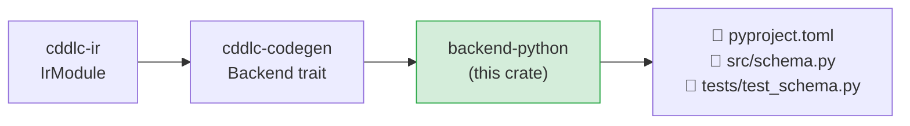

# backend-python

Generates a complete Python 3 library — `pyproject.toml`, a source module, and a pytest
test suite — from an `IrModule`.  The generated code uses Python dataclasses for types,
[cbor2](https://pypi.org/project/cbor2/) for CBOR, and the built-in `json` module for JSON.

## Position in the pipeline



## Generated output layout

```
<output>/
  pyproject.toml           # PEP 517 build config; deps: cbor2; devDeps: pytest
  src/
    <module>.py            # all types as @dataclass with encode/decode methods
  tests/
    test_<module>.py       # pytest roundtrip tests for every type
```

## Runtime

| Format | Runtime library |
|---|---|
| CBOR (default) | [cbor2](https://pypi.org/project/cbor2/) — pure-Python RFC 8949 |
| JSON | Built-in `json` module |

## What is generated per IR type

### Structs

```python
from dataclasses import dataclass, field
from typing import Optional

@dataclass
class Device:
    id:     str
    active: bool
    label:  Optional[str] = None    # optional field

    def to_cbor(self) -> bytes: …
    @classmethod
    def from_cbor(cls, data: bytes) -> "Device": …

    def to_json(self) -> dict: …
    @classmethod
    def from_json(cls, data: dict) -> "Device": …
```

- Optional fields use `Optional[T]` with a default of `None`.
- CBOR maps use string keys by default; integer keys are used when specified in CDDL.
- JSON encode/decode uses `dict` literals — no extra library required.

### Enums

```python
from enum import Enum

class Status(Enum):
    OK    = "ok"
    WARN  = "warn"
    ERROR = "error"
```

Integer-valued variants use `int` values; mixed-type enums use a tagged-dict encoding
with `{"kind": name, "value": raw}` to avoid Python's strict `Enum` typing.

### Arrays

```python
@dataclass
class Readings:
    items: list[float] = field(default_factory=list)

    def to_cbor(self) -> bytes: …
    @classmethod
    def from_cbor(cls, data: bytes) -> "Readings": …
```

### Aliases

```python
DeviceId = str    # transparent type alias
```

## Supported serialization formats

| `--format` | Generated methods |
|---|---|
| `cbor` (default) | `to_cbor() → bytes`, `from_cbor(bytes)` |
| `json` | `to_json() → dict`, `from_json(dict)` |

## Install and test generated code

```bash
cd <output>/
pip install -e ".[dev]"
pytest tests/
```

Requires Python 3.10+ (uses `match` statements and `list[T]` generic syntax).

## Known gaps and future enhancements

- **Partial constraint validation**: `.size` and `.range` checks emit `ValueError` raises
  in constructors; `.regexp` constraints are not yet emitted as `re.fullmatch()` checks.
- **Python 3.10+ minimum**: the generated code uses structural pattern matching (`match`)
  for enum decode.  A `3.8`-compatible fallback using `if/elif` chains would broaden reach.
- **No `__slots__`**: `@dataclass` classes do not have `__slots__` enabled; adding them
  would reduce per-instance memory overhead for large collections of objects.
- **No `@doc` as docstrings**: doc pragmas are not rendered as class-level `"""…"""` docstrings.
- **No type-checking for JSON input**: `from_json` trusts the input dictionary; adding
  `isinstance` guards or integrating `pydantic` would improve robustness.
- **No packaging for PyPI**: the `pyproject.toml` is a library definition but no
  publishing configuration (classifiers, wheel build, upload) is included.
- **No interop harness for Dart**: the `--interop-langs` list does not include `dart`.

## License

MIT OR Apache-2.0
